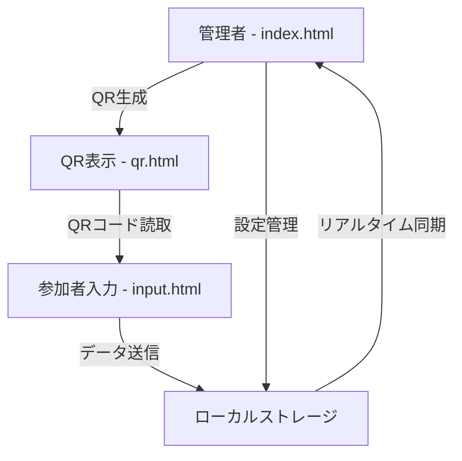

# QRコード参加管理システム

🎯 **一時的な参加者管理を効率化するQRコードベースの受付システム**

プライバシー保護に配慮し、サーバーを使わずローカルストレージのみでデータ管理を行う静的ウェブアプリケーションです。

  

## 📖 目次

- [🚀 主要機能](#-主要機能)
- [🎯 対象ユーザー](#-対象ユーザー)
- [📁 プロジェクト構成](#-プロジェクト構成)
- [⚙️ システム構成](#️-システム構成)
- [🔧 実装状況](#-実装状況)
- [🐛 既知の問題と改善点](#-既知の問題と改善点)
- [📱 使用方法](#-使用方法)
- [🛠️ 技術仕様](#️-技術仕様)
- [📊 データフロー](#-データフロー)
- [🔒 セキュリティとプライバシー](#-セキュリティとプライバシー)
- [📋 開発ロードマップ](#-開発ロードマップ)

## 🚀 主要機能

### ✅ **実装済み機能**

#### **管理者機能 (index.html)**
- 📋 **項目設定**: 収集する情報のカスタマイズ（名前、所属、連絡先、カスタムフィールド3項目）
- 🔗 **QRコード生成**: 参加者入力フォームURLを含むQRコード生成
- 👥 **リアルタイム参加者管理**: 受付状況の即座確認
- 📊 **統計表示**: 総参加者数、本日の参加者、直近1時間の参加者
- 🔍 **検索・フィルタリング**: 参加者名による検索機能
- 🗑️ **データクリア**: 確認ダイアログ付きの安全な削除機能

#### **QRコード表示 (qr.html)**
- 📱 **自動QRコード生成**: input.htmlへのURLを含むQRコード表示
- 🖨️ **印刷対応**: プリンタフレンドリーなデザイン
- 📖 **使用説明**: 参加者向けの分かりやすい操作ガイド

#### **参加者入力フォーム (input.html)**
- 🎛️ **動的フィールド表示**: 管理者設定に基づく項目の表示/非表示
- ✔️ **リアルタイムバリデーション**: 入力内容の即座チェックとエラー表示
- 📱 **モバイル最適化**: スマートフォンでの使いやすさを重視
- 🎨 **送信フィードバック**: 成功・エラー状態の視覚的表示

### 🔄 **システム連携機能**
- 🔗 **データ同期**: 統一されたローカルストレージキー（`qr_config`, `qr_attendees`）
- ⚡ **リアルタイム更新**: Storage イベントによる複数タブ間の即座データ反映
- 🔔 **通知システム**: 新規参加者追加時の視覚的通知

## 🎯 対象ユーザー

- 🏫 **学校・教育機関の職員** - 保護者会、説明会、学校行事の受付
- 🎪 **イベント主催者** - ワークショップ、セミナー、体験会の参加管理
- 👶 **学童・塾の運営者** - 日々の入退室管理、送迎管理
- 🏢 **企業・団体** - 研修、会議、一時的な受付業務
- 🚑 **災害避難所** - 避難者の仮登録、プライバシー配慮が必要な場面

## 📁 プロジェクト構成

```
webtool_qr_code1/
├── 📄 index.html           # 管理者画面（メイン）
├── 📄 qr.html             # QRコード表示ページ
├── 📄 input.html          # 参加者入力ページ
├── ⚙️ app.js              # メインJavaScript（528行）
├── 🎨 style.css           # 共通スタイルシート（未使用）
├── 📋 MVP仕様書.md        # 詳細仕様書
├── 💡 実装案.txt          # 実装アイデアと用途案
└── 📖 README.md           # このファイル
```

## ⚙️ システム構成

### **アーキテクチャ**


### **データフロー**
1. **設定フェーズ**: 管理者が収集項目を設定
2. **QR生成フェーズ**: 入力フォームURLを含むQRコード生成
3. **参加受付フェーズ**: 参加者がQRコード読取→情報入力→送信
4. **管理フェーズ**: リアルタイムで参加者一覧確認・管理

## 🔧 実装状況

### ✅ **完全実装済み（100%）**
- [x] 基本UI設計とレスポンシブ対応
- [x] QRコード生成・表示機能
- [x] 参加者情報入力・バリデーション
- [x] ローカルストレージによるデータ永続化
- [x] リアルタイムデータ同期
- [x] 検索・フィルタリング機能
- [x] データクリア機能（安全性確保）
- [x] エラーハンドリングと通知システム

### 🔧 **技術的実装詳細**
- **フロントエンド**: HTML5 + Vanilla JavaScript ES6+
- **QRコード生成**: qrcode.js ライブラリ（CDN）
- **UIアイコン**: Font Awesome 6.4.0（CDN）
- **データストレージ**: localStorage API
- **レスポンシブ**: CSS Grid, Flexbox使用

## 🐛 既知の問題と改善点

### 🚨 **高優先度の問題**

#### **1. スタイル管理の問題**
- **問題**: `index.html`内に大量のインラインCSS（426行）が存在
- **影響**: メンテナンス性の低下、コードの重複
- **修正案**: `style.css`への統合とクラス化

#### **2. UI一貫性の問題**
- **問題**: 各ページで異なるスタイル定義
- **影響**: ユーザビリティの低下、ブランドの不統一
- **修正案**: 共通コンポーネント化

### ⚠️ **中優先度の改善点**

#### **3. モバイル最適化**
- **問題**: タッチターゲットサイズの不統一
- **改善案**: 44px以上のタッチエリア確保

#### **4. アクセシビリティ**
- **問題**: WAI-ARIA対応不足
- **改善案**: screen reader対応とキーボードナビゲーション

#### **5. パフォーマンス**
- **問題**: CDNライブラリの読み込み時間
- **改善案**: 重要でないリソースの遅延読み込み

### 💡 **低優先度の拡張案**

#### **6. 機能拡張**
- CSVエクスポート機能
- データバックアップ・リストア
- テーマ切り替え（ライト/ダーク）
- 多言語対応

## 📱 使用方法

### **1. 管理者の準備**
1. `index.html`をブラウザで開く
2. 「設定」タブで収集する情報項目を選択
3. カスタムフィールドが必要な場合は名前を設定
4. 「QR生成」タブでQRコードを生成

### **2. QRコードの設置**
1. 生成されたQRコードを印刷または画面表示
2. 受付場所に設置
3. 参加者にスマートフォンで読み取ってもらう

### **3. 参加者の受付**
1. 参加者がQRコードを読み取り
2. 自動で入力フォーム（`input.html`）が開く
3. 必要事項を入力して送信
4. 管理画面にリアルタイムで表示

### **4. データ管理**
1. 「参加者一覧」タブで受付状況確認
2. 検索機能で特定参加者を検索
3. 用途終了後「データ管理」タブでデータクリア

## 🛠️ 技術仕様

### **システム要件**
- **ブラウザ**: モダンブラウザ（Chrome 80+, Firefox 75+, Safari 13+, Edge 80+）
- **JavaScript**: ES6+ 対応必須
- **ストレージ**: localStorage 対応必須（5MB制限）
- **ネットワーク**: 初回読み込み時のみ必要（CDNリソース取得）

### **依存関係**
```json
{
  "dependencies": {
    "qrcode": "^1.5.3",
    "font-awesome": "^6.4.0"
  },
  "features": {
    "localStorage": "required",
    "ES6": "required",
    "flexbox": "required",
    "grid": "optional"
  }
}
```

### **ブラウザサポート**
| ブラウザ | デスクトップ | モバイル | 
|---------|-------------|----------|
| Chrome | ✅ 80+ | ✅ 80+ |
| Firefox | ✅ 75+ | ✅ 75+ |
| Safari | ✅ 13+ | ✅ 13+ |
| Edge | ✅ 80+ | ✅ 80+ |

## 📊 データフロー

### **ローカルストレージ構造**
```javascript
// 設定データ（qr_config）
{
  "fields": {
    "name": true,           // 必須項目（固定）
    "organization": false,  // 所属・学年
    "contact": false,       // 連絡先
    "custom1": false,       // カスタム項目1
    "custom2": false,       // カスタム項目2
    "custom3": false        // カスタム項目3
  },
  "customFieldNames": {
    "custom1": "",          // カスタム項目1の名前
    "custom2": "",          // カスタム項目2の名前
    "custom3": ""           // カスタム項目3の名前
  }
}

// 参加者データ（qr_attendees）
[
  {
    "id": 1640995200000,           // ユニークID（タイムスタンプ）
    "name": "田中太郎",             // 参加者名
    "organization": "3年A組",       // 所属・学年
    "contact": "090-1234-5678",     // 連絡先
    "customFields": {              // カスタムフィールド
      "custom1": "アレルギー無し",
      "custom2": "",
      "custom3": ""
    },
    "timestamp": "2023-12-31T15:00:00.000Z"  // 受付日時
  }
]
```

### **API設計（内部関数）**
```javascript
// 主要な公開関数
window.addNewAttendee(attendeeData)     // 新規参加者追加
window.getCurrentConfig()               // 現在の設定取得
window.getQRConfig()                    // 設定データ取得
```

## 🔒 セキュリティとプライバシー

### **プライバシー保護**
- ✅ **ローカル保存**: 全データはブラウザのローカルストレージのみ
- ✅ **サーバー送信なし**: インターネット接続は初回リソース読み込みのみ
- ✅ **一時的利用**: 用途終了後の簡単なデータクリア
- ✅ **個人情報最小化**: 必要最小限の項目のみ収集

### **セキュリティ対策**
- ✅ **XSS対策**: HTMLエスケープ処理実装
- ✅ **データバリデーション**: クライアントサイドでの入力検証
- ✅ **エラーハンドリング**: 適切なエラーメッセージとロギング

### **制限事項**
- ⚠️ **ブラウザ依存**: ローカルストレージクリア時のデータ消失
- ⚠️ **同一ドメイン**: 同じブラウザ・同じドメインでのみデータ共有
- ⚠️ **プライベートブラウジング**: シークレットモードでは利用不可

## 📋 開発ロードマップ

### **🚀 Version 1.1 (優先度: 高)**
- [ ] CSSファイル統合とスタイル整理
- [ ] モバイルUX最適化
- [ ] アクセシビリティ改善（WAI-ARIA対応）
- [ ] エラーメッセージの多言語対応

### **🎯 Version 1.2 (優先度: 中)**
- [ ] CSVエクスポート機能
- [ ] データバックアップ・リストア
- [ ] 統計ダッシュボード強化
- [ ] PWA（Progressive Web App）対応

### **💡 Version 2.0 (優先度: 低)**
- [ ] テーマシステム（ライト/ダーク）
- [ ] 多言語対応（英語、中国語、韓国語）
- [ ] オフライン機能強化
- [ ] 印刷レイアウト最適化

## 🤝 コントリビューション

### **開発環境セットアップ**
```bash
# プロジェクトクローン
git clone [repository-url]
cd webtool_qr_code1

# ローカルサーバー起動（例：Python）
python -m http.server 8000

# ブラウザでアクセス
open http://localhost:8000
```

### **コーディング規約**
- **JavaScript**: ES6+ 記法使用
- **CSS**: BEM記法推奨
- **命名**: camelCase（JavaScript）、kebab-case（CSS）
- **コメント**: 日本語で機能説明を記述

## 📞 サポート・問い合わせ

### **ドキュメント**
- 📋 [MVP仕様書](./MVP仕様書.md) - 詳細な仕様とUI設計
- 💡 [実装案](./実装案.txt) - 用途例と実装アイデア

### **トラブルシューティング**

#### **QRコードが生成されない**
- インターネット接続を確認
- ブラウザのJavaScript有効化確認
- ブラウザの最新版への更新

#### **参加者データが表示されない**
- ローカルストレージの有効化確認
- 同じブラウザ・同じドメインでの使用確認
- プライベートブラウジングモードの無効化

#### **モバイルで入力フォームが表示されない**
- QRコードの正確な読み取り確認
- モバイルブラウザの最新版への更新
- JavaScript対応ブラウザの使用確認

---

**🎉 開発完了日**: 2024年12月  
**📝 最終更新**: 2024年12月  
**👨‍💻 開発者**: QRコード参加管理システム開発チーム  
**📄 ライセンス**: MIT License

> 💡 **Tips**: このシステムは教育現場、イベント運営、一時的な受付業務など幅広い用途で活用できます。プライバシー保護を重視した設計により、安心してご利用いただけます。